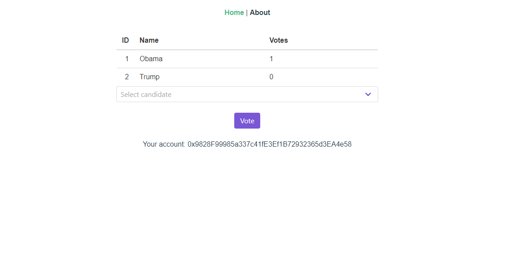

# Vue Voting dApp

<p align="center">		
  		
</p>
 
This project was generated with [vue-cli](https://github.com/vuejs/vue-cli) version 3.2.1

An Vue [truffle](https://github.com/trufflesuite/truffle) voting mechanism dApp.

Sample contract is deployed on the Kovan testnetwork

# Demo



# Project setup
MetaMask and Infura account are both required for this project to work!

### MetaMask
I would like to refer to this [article](https://medium.com/singapore-blockchain-dapps/how-to-get-testcoin-from-ethereum-kovan-testnetwork-85c466d5b869) for a simple tutorial on how to setup MetaMask and get some free test Ether on your Kovan account! After that you have your ETH address you need for the .env file

### Infura
Infura is a hosted Ethereum node cluster that lets you run your application without requiring them to set up their own Ethereum node or wallet. Register an account [here](https://infura.io/register) and require your API key you need for the .env file!

### Get ganache-cli and truffle running on your environment
```
npm install -g truffle ganache-cli
```
### Start ganache-cli
```
ganache-cli
```
After running this command you should be able to find your MNEMONIC you need for the .env file

### Install dependencies
```
git clone https://github.com/marlowl/vue-voting-dapp/
```
```
npm install
```

### Update the .env file
```
VUE_APP_ETHADDRESS= "your ETH address"
MNEMONIC= "your ganache MNEMONIC"
INFURA_API_KEY= "your infura key"
```
### Run the development server
```
npm run serve
```

# Compile your own smart contracts
Add your smart contract to the /contracts folder 

### Compile the contract
```
truffle compile
```
### Migrate your contract to the ropsten network
```
truffle migrate --network ropsten
```
### Change the current address to your deployed contract address
```
    let myContract = new web3.eth.Contract(
      MyContract.abi,
      "Your deployed contract address"
    );
```


