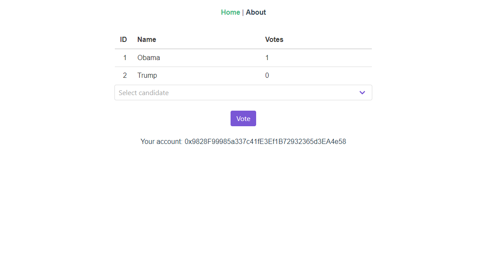

## Vue 3 Voting dApp (2025 Modernized)

Decentralized voting application built with:

- Vue 3 + TypeScript
- Ethers.js v6
- Truffle (contracts, compilation & migration)
- OpenZeppelin Contracts
- BootstrapVue Next (UI components)
- Solidity 0.8.20

The sample `Election` contract supports adding candidates (owner only), starting / ending the election, and one-vote-per-address enforcement. Default target testnet: Sepolia.



---
## 1. Prerequisites

Install (or make sure you have):

- Node.js 18+ (LTS recommended)
- npm 9+
- MetaMask browser extension
- An Infura account (for Sepolia RPC) https://infura.io

Global (optional) tools:
```
npm install -g truffle
```
You can also use `npx truffle` everywhere without the global install.

---
## 2. Clone & Install
```
git clone https://github.com/marlowl/vue-voting-dapp.git
cd vue-voting-dapp
npm install
```

---
## 3. Environment Variables
Create a `.env` file in the project root (same level as `package.json`). Example:
```
MNEMONIC="twelve word seed phrase for deploy account"
INFURA_API_KEY="your-infura-project-id"
VUE_APP_DEFAULT_NETWORK="sepolia"   # used client‑side if you add logic
```
Notes:
- The mnemonic should correspond to a wallet you control (funded with a little Sepolia ETH for gas). NEVER commit your mnemonic.
- To get Sepolia test ETH, use a reputable faucet (search "Sepolia faucet").

---
## 4. Local Development (Frontend Only)
If you only want to work on the Vue UI and already have contract artifacts in `build/contracts`, just run:
```
npm run serve
```
The dev server will auto-reload. Open http://localhost:8080 (default). Make sure MetaMask is connected to the same network the artifacts expect (e.g., Sepolia) or adapt the code to point to a local chain.

---
## 5. Running a Local Blockchain (Optional)
You can use Ganache UI or CLI. Example with Ganache CLI via the `ganache` npm package:
```
npx ganache --wallet.seed "test test test test test test test test test test test junk" --chain.chainId 1337
```
Update `.env` if you want to deploy to this local chain (you can omit Infura when local). Then configure a MetaMask custom network pointing to `http://127.0.0.1:8545` (or 7545 depending on your ganache port) with the matching chain ID.

In `truffle-config.js` a `development` network is already defined (host 127.0.0.1, port 7545). Start Ganache on that port or adjust the config.

---
## 6. Compile & Deploy Contracts
Compile (generates ABI + bytecode into `build/contracts`):
```
npx truffle compile
```

Migrate to local development network (Ganache):
```
npx truffle migrate --network development
```

Migrate to Sepolia testnet:
```
npx truffle migrate --network sepolia
```

On success, Truffle writes an updated `Election.json` artifact with the deployed address keyed under the network ID. The frontend reads this file at runtime (import in `Home.vue`) to discover the contract address, so no manual address patching is needed as long as you replace the artifact after each deploy.

If you deploy to a different network than Sepolia, ensure your frontend resolves the correct `network.chainId` and that the artifact contains that ID.

---
## 7. Frontend ↔ Contract Connection
In `src/views/Home.vue` we:
1. Detect `window.ethereum` & request accounts.
2. Determine the current chain via `provider.getNetwork()`.
3. Look up `ElectionContract.networks[network.chainId]` inside the imported artifact.
4. Instantiate an `ethers.Contract` with ABI + address.

If you see errors like "Cannot read property 'address' of undefined" it usually means:
- The contract wasn't deployed to that chain ID.
- The artifact file is stale (rebuild / redeploy).
- MetaMask is on a different network than expected.

---
## 8. Testing
### Smart Contract Tests
Add tests under `tests/` (Truffle style) or use `truffle test`:
```
npx truffle test
```

### Frontend Unit / E2E (placeholders)
Existing scripts:
```
npm run test:unit
npm run test:e2e
```
Setup for these (Nightwatch, etc.) can be expanded as needed.

---
## 9. Lint & Type Check
```
npm run lint
```
TypeScript checks run during build/serve; you can add a dedicated script if desired.

---
## 10. Build for Production
```
npm run build
```
Outputs static assets to `dist/` ready to host on any static server.

---
## 11. Common Issues & Tips
| Problem | Likely Cause | Fix |
|---------|--------------|-----|
| Network mismatch / contract not found | Chain ID differs from artifact entry | Deploy to that chain or switch MetaMask network |
| MetaMask not detected | Extension missing | Install MetaMask and refresh |
| Stale ABI | Contract changed | Re-run `truffle compile` and redeploy |
| Gas issues on Sepolia | Low balance | Get more test ETH |

---
## 12. Security Notes
- Never commit real mnemonics or private keys.
- Use a dedicated test wallet for deployments.
- Review contract logic (e.g., reentrancy isn't relevant here but state transitions matter).

---
## 13. Tech Stack Overview
| Layer | Tech |
|-------|------|
| UI | Vue 3, BootstrapVue Next |
| State | Vuex |
| Blockchain API | Ethers.js v6 |
| Contracts | Solidity 0.8.20 + OpenZeppelin Ownable |
| Tooling | Truffle, TypeScript, ESLint |

---
## 14. Roadmap Ideas
- Add wallet disconnection & multi-network selector.
- Persist election results off-chain (TheGraph / IPFS) for indexing.
- Add candidate removal UI.
- Add unit tests for contract interaction logic.

---
## 15. License
MIT


